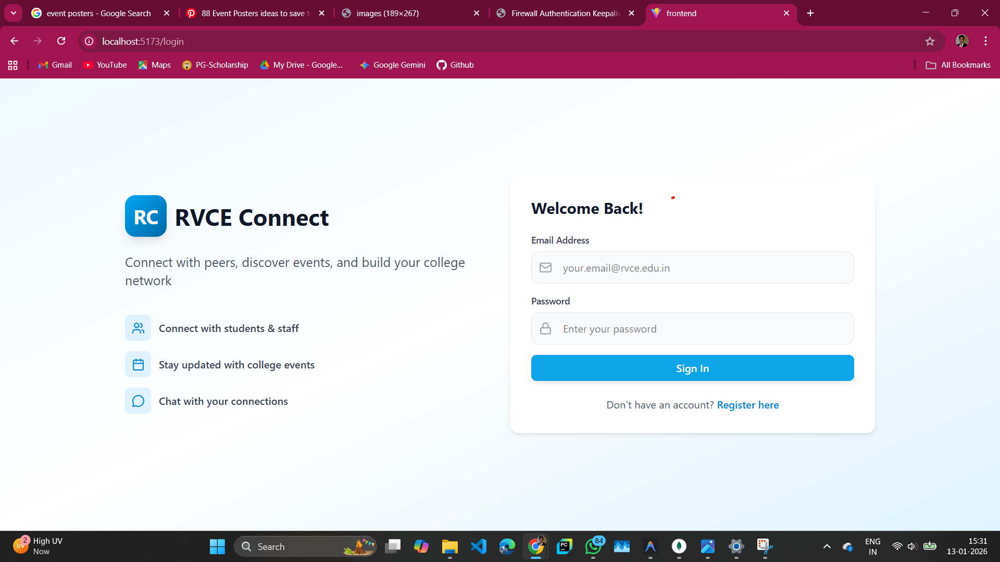
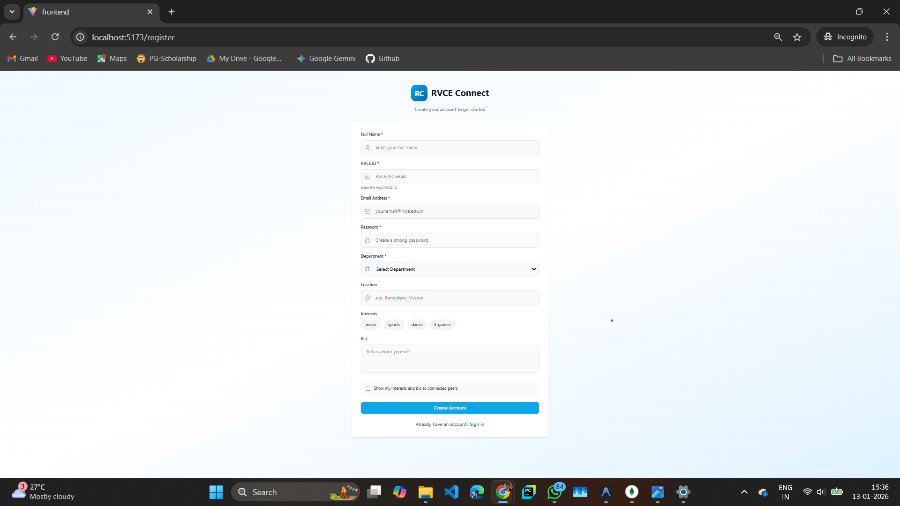
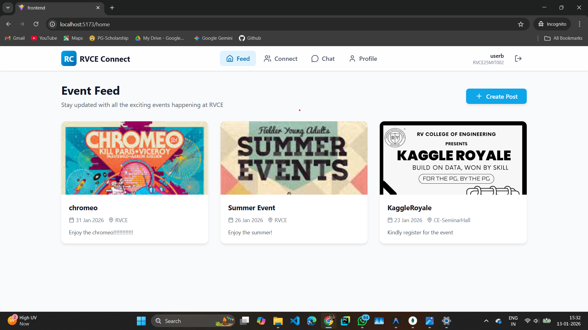
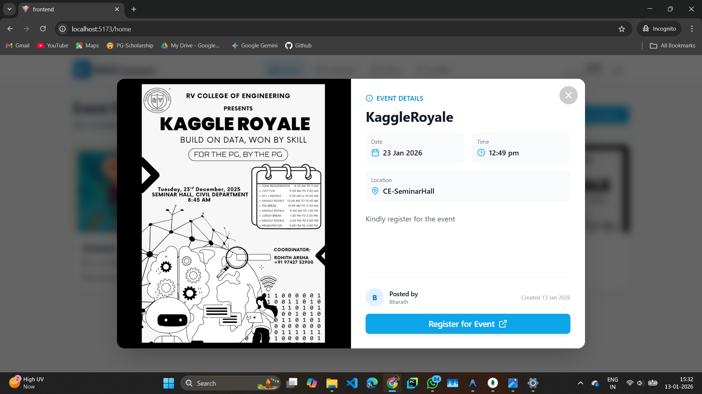
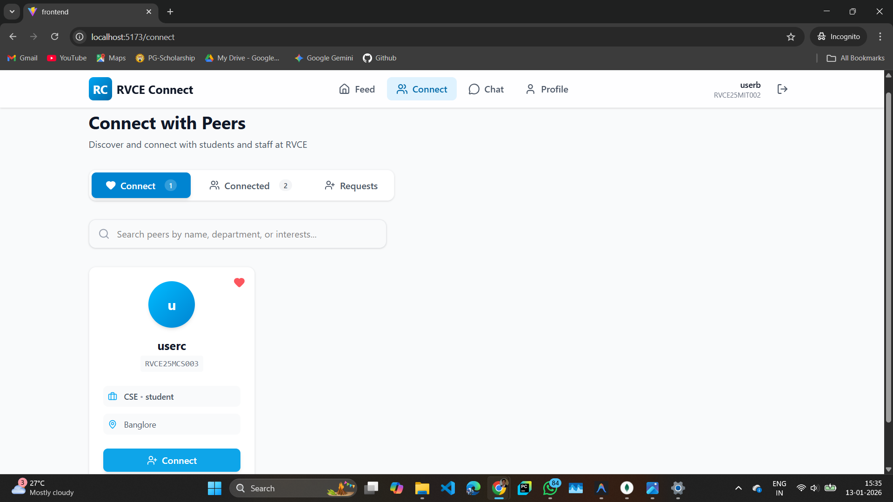
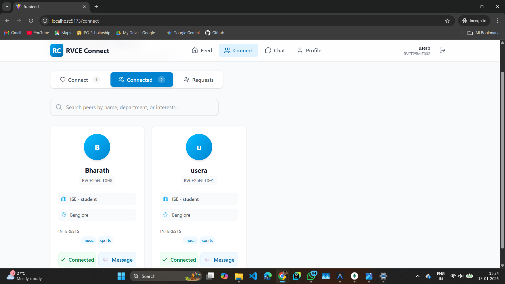
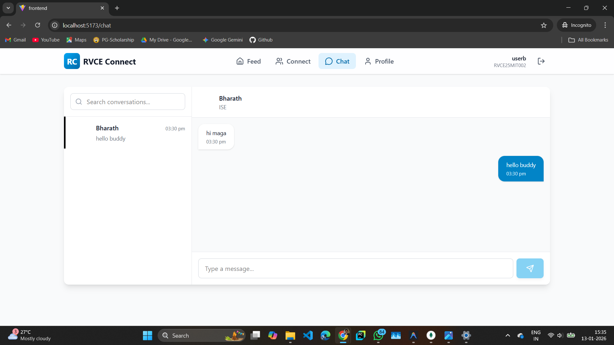

# RVCE Connect

**RVCE Connect** is a social platform for RV College of Engineering, connecting students and faculty through interests and events.

## 📸 Project Overview

### Authentication
Secure login and registration with RVCE ID validation.

### Event Feed
Stay updated with the latest college events and announcements.

### Connect & Network
Find peers with similar interests and build your network.

### Real-Time Chat
Instant messaging with your connections.

## 🛠️ Tech Stack

- **Frontend**: React, Vite, TailwindCSS
- **Backend**: Node.js, Express, MongoDB, Socket.io
- **Features**: Auth, Real-time Chat, Smart Recommendations

## 🚀 Quick Start

1.  **Backend**: `cd Backend && npm install && npm start`
2.  **Frontend**: `cd Frontend && npm install && npm run dev`

